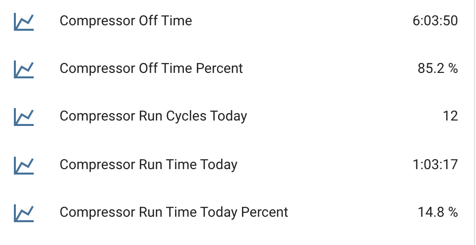
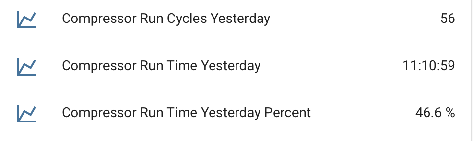

# HVACMonitor: Project to Monitor My HVAC System

I live in Florida and that means rising temperatures in the summer, along with surging electric bills for cooling.

A couple years back, my air conditioner had trouble keeping up with the hotter temperatures and seemed to run all the time.  By the time I got a technician out to look at it, most of the coolant had leaked out.  Refilling it was a big expense.  That got me thinking that I needed a better way to understand how the system was working.

Fresh off an ESPHome/Homeassistant project to monitor my home alarm system, I went looking for a solution.

I came across [Jim Shank's](https://github.com/jshank) great [AC Watcher project](https://github.com/jshank/ACWatcher/blob/main/README.md).  I used a number of his ideas that got this project moving much more quickly.  Thank you Jim!

Some of my functional goals:
- Monitor the current state of the HVAC system: heat/cooling, fan on/off, compressor on/off
- Monitor the effectiveness by sampling intake and discharge temperatures
- Monitor the temperatures where all that cold air runs through ducts sitting in a hot attic
- Monitor the power consumption of the whole system - compressor and air handler
- Minimal changes to the HVAC system, and nothing that would void any warranties.

I ended up building this in several parts:
- An ESPHome-based monitor for everything other than power consumption
- A commercially available power monitor I could install in my breaker panel to capture the compressor and air handler power consumption.  More on this later.
- Homeassistant to provide visibility and additional, statstical, information

## Table of Contents
- [HVACMonitor: Project to Monitor My HVAC System](https://github.com/czsmith/HVAC-Monitor#hvacmonitor-project-to-monitor-my-hvac-system)
  - [Current Information from the ESPHome on the HVAC Monitor board](https://github.com/czsmith/HVAC-Monitor#current-information-from-the-esphome-on-the-hvac-monitor-board)
  - [Full Information in Homeassistant](https://github.com/czsmith/HVAC-Monitor#full-information-in-homeassistant)
  - [Accessing HVAC State](https://github.com/czsmith/HVAC-Monitor#accessing-hvac-state)
- [Hardware; The HVAC Monitor Board](https://github.com/czsmith/HVAC-Monitor#hardware-the-hvac-monitor-board)
  - [Architecture](https://github.com/czsmith/HVAC-Monitor#architecture)
    - [Design Tools](https://github.com/czsmith/HVAC-Monitor/tree/main#design-tools)
  - [The Build](https://github.com/czsmith/HVAC-Monitorthe-build)
    - [Identifying Signal Wires](https://github.com/czsmith/HVAC-Monitor#identifying-signal-wires)
    - [Wiring](https://github.com/czsmith/HVAC-Monitor#wiring)
    - [Double Check](https://github.com/czsmith/HVAC-Monitor#double-check)
    - [Bench Setup](https://github.com/czsmith/HVAC-Monitor#adjust-voltage)
    - [Adjust Voltage](https://github.com/czsmith/HVAC-Monitor#adjust-voltage)
    - [Assemble the Temperature Probes](https://github.com/czsmith/HVAC-Monitor#adjust-voltage)
  - [ESPHome Software for the Monitor Board](https://github.com/czsmith/HVAC-Monitor#esphome-software-for-the-monitor-board)
    - [Basic Setup](https://github.com/czsmith/HVAC-Monitor#basic-setup)
    - [Define the Probe Sensors](https://github.com/czsmith/HVAC-Monitor#define-the-probe-sensors)
    - [Finding the Temperature Probe Address](https://github.com/czsmith/HVAC-Monitor#finding-the-temperature-probe-address)
    - [Derive a Sensor for the Difference Between Intake and Discharge Temperatures](https://github.com/czsmith/HVAC-Monitor#derive-a-sensor-for-the-difference-between-intake-and-discharge-temperatures)
    - [Define Sensors for the State of the HVAC](https://github.com/czsmith/HVAC-Monitor#define-sensors-for-the-state-of-the-hvac)
    - [Diagnostic Sensor](https://github.com/czsmith/HVAC-Monitor#diagnostic-sensor)
    - [Derive a Sensor to Provide Overall HVAC Status](https://github.com/czsmith/HVAC-Monitor#derive-a-sensor-to-Provide-Overall-HVAC-Status)
  - [Programming the HVAC Monitor Board](https://github.com/czsmith/HVAC-Monitor#programming-the-hvac-monitor-board)
  - [Testing the HVAC Monitor Board](https://github.com/czsmith/HVAC-Monitor#testing-the-hvac-monitor-board)
    - [Check Temperature Probes](https://github.com/czsmith/HVAC-Monitor#check-temperature-probes)
    - [Check State Sensor Inputs](https://github.com/czsmith/HVAC-Monitor#check-state-sensor-inputs)
  - [Connect the HVAC Monitor Board to Your HVAC System](https://github.com/czsmith/HVAC-Monitor#connect-the-hvac-monitor-board-to-your-hvac-system)
    - [Mounting the HVAC Monitor](https://github.com/czsmith/HVAC-Monitor/edit/main/README.md#mounting-the-hvac-monitor)
    - [Install the Temperature Probes](https://github.com/czsmith/HVAC-Monitor#install-the-temperature-probes)
- [Home Assistant: Get the Full View](https://github.com/czsmith/HVAC-Monitor#home-assistant-get-the-full-view)
  - [ESPHome Integration in Home Assistant](https://github.com/czsmith/HVAC-Monitor#esphome-integration-in-home-assistant)
  - [View of Today's HVAC activity](https://github.com/czsmith/HVAC-Monitor#view-of-todays-hvac-activity)
  - [View of Yesterday's HVAC activity](https://github.com/czsmith/HVAC-Monitor#view-of-yesterdays-hvac-activity)


## Current Information from the ESPHome on the HVAC Monitor board
The HVAC Monitor board has an on-board web server to show basic, current state information.


## Full Information in Homeassistant
Homeassistant has many more capabilities to create additional views and enrich the sensor data from the HVAC monitor board. It also integrates data from other sensor devices into a complete view of the HVAC system. In this view Homeassistant is computing run times and is merging data from the HVAC Monitor board and the power monitor in the breaker panel.


Homeassistant can pull data collected over time and provide graphical displays:


In this case, when the compressor was running at top and what the ambient temperature was in the attic at the same time. Data is pulled from the past five days.


## Accessing HVAC State
In a traditional heap pump scenario, all the information about the state is available by monitoring the signals from the thermostat to the HVAC system.

A typical heat pump HVAC system is controlled by a thermostat which receives power form the air handler and sends control signals to the air handler and the compressor as illustrated below:


The signals to control the compressor (whether one or two stages), fan, auxillary heater and heat/cool mode are present as 0VAC or 24VAC on the connection between the thermostat and the air handler.  I tapped this cable, outside of the air handler, to get access to the HVAC state.  So I just picked up some thermostat wire (8/18 guage) at my local big box store and accessed the signals in my attic:


**NOTICE: OF COURSE,  YOU NEED TO DETERMINE THE CONFIGURATION FOR YOUR PARTICULAR SYSTEM.  THESE ARE COMMON FOR POPULAR HONEYWELL THERMOSTSATS.**

**IT IS ALSO CRITICAL FOR THIS IMPLEMENTATION THAT THE POWER NOT EXCEEED 30VAC.**

**THIS DESIGN IS FOR HVAC SYSTEMS WITH ONE OR TWO STAGE COMPRESSORS AND ONE OR TWO STAGE HEATING**

# Hardware; The HVAC Monitor Board
The heart of this project is the HVAC Monitor board.  This is the device which collects most of the information about the current state of the HVAC system. On its own, it can give a "current" view of the operation of your system.

## Architecture
The HVAC monitor is built using a WEMOS D1 Mini ESP develpment board, running ESPHome.  


The main blocks are:

- Power supply to convert the 24 to 28 VAC power to 5VDC.  For this, we take power from the power and common signals (red an blue in my case) and run it through a rectifier and into a LM2596S DC-DC buck converter.  Since 28VAC peaks at 40VDC and this device is rated for 12 to 40VDC, I added two diodes to drop the incoming DC volatage by 2-3V.  
Also, during development, I like to power the monitor with a USB port so there's a jumper to disconnect the output of the buck converter from the 5V input on the ESP board. When pins 1&2 are jumpered, power is provided externally. When not jumpered, a USB cable plugged into the ESP board provides power.

- Signal conditioners to isolate the input AC signals and convert them to levels the ESP can handle.  I'm using 4N35 opto isolators, but any similar part would be fine. (I had a bunch lying around from a prior project). Since these are DC devices, a diode is needed along with the resistors to reduce the input current.  If you use an AC opto isolator, the diode isn't necessary.
There are two "common" terminals, one for the sensors and one for the power source. Jumping pins 1 and 2 connect these.  This allows a separate power source from the thermostat. **BUT NOTE: the commons are connected in the LM2596S buck converter, so a separate floating power source is required if you use this option.**
Also note that two-stage heat pumps have second a signal to the compressor.  In this design, just wire both signals to the Compressor and Compressor2 inputs. HVAC Monitor only reports one compressor state regardless of which compressor input is asserted.

- Interface to Dallas DM18B20 type temperature sensors. This is a one-pin interface. The sensors use 3.3V, ground and a shared signal bus to send temperature readings. The probes for the intake, discharge and ambient temperatures can be connected with either a 4-pin header or KF2510 connectors. It doesn't matter which connector is used; probes are identified by address, not connector.

- WEMOS D1 Mini board.

Since the control signals are AC, they need to be converted to DC for the ESP.  But they're also 60HZ, so if the opto output were fed directly to the ESP, it'd be triggering 120 times per second on each active line.  Software debouncing could address that problem, but I used a hardware solution. A 4.7uF capacitor is connected to the opto output with a high pull-up resistor. When the AC signal is asserted, the capacitor is discharged through the isolator producing a low input.  Before the next cycle, the voltage only builds up to about 500mV, which continues to read as a low signal by the ESP.  Feel free to play around with different capacitor and resistor values.

### Design Tools
Schematics were captured with EasyEDA, a free schematic capture and PCB design product which is aviliable online via browser or can be installed on a Windows, Mac or Linux machine.

My first prototype was all hand wired on three pad-boards. Needing to make another, I used the EasyEDA PCB layout tool to create a two-layer PC board.  For a very small amount of money and about 2 weeks, NextPCB.com delivered 5 boards.


You'll find the schematic and Gerber files in the Github repository.

## The Build

### Identifying Signal Wires
We will need to connect the main signals from the thermostat to the HVAC system.  The first step in this is to identify which wires carry which signals.

The best place to start is always with the documentation for your thermostat and air handler.  Get the model numbers and look them up on the internet.  This should give the best starting point. If you are willing, a peek inside the air handler will allow you to quickly identify the Power and Common wires.

In my system, with a Honeywell FocusPRO® TH5000 thermostat, the signals are:
| Color  | Purpose                                                  | When High relative to Common |
| ------ | -------------------------------------------------------- | ---------------------------- |
| Red    | Power.  24-28 VAC - Power thermostat and HVAC Monitor    | Always high               | 
| Blue   | Common                                                   | Never high                   |
| Yellow | Contactor - Compressor main (or only) stage              | Compressor on                |
| Orange | Changeover - Selects heat or cool mode                   | Depends on thermostat / compressor |
| Green  | Fan                                                      | Fan on                       |
| White  | Auxillary / Emergency heat                               | Heater coils on              |


After that, we need to tap into the cable carrying these signals.  Playing with the thermostat and putting the system into various modes should allow us to identify all the signal wires.  The following table shows the most likely outcome for various settings on the thermostat to aid in figuring which wire carries which signal. 

**NOTE: THIS WORKED FOR ME AND SHOULD WORK, IN GENERAL.  ALWAYS USE YOUR OWN JUDEGEMENT. THE PROCESS IS NOT GUARANTEED. DO THIS AT YOUR OWN RISK.**

Put your voltmeter on the AC setting.

Most likely, your thermostat uses an almost-standard color scheme.  See [here](https://www.aireserv.com/about/blog/2020/february/the-thermostat-wire-color-code-you-need-to-know/) for an explanation.

The first task is always to locate the Common and then the Power wires. With the thermostat in the OFF position and the Fan on Auto, look for the two leads, in any combination, that produce 24-28VAC. Use any documentation as guideance. It definitely pays to start with the red lead as the main power source and blue or black as the Common.  

One complication in identifying wires is that fact that there is no particular standard for the Reverse signal. On some compressors, a HIGH reverse signals cooling mode and on some it signifies heating mode.  Thus it's possible that in searching for the Power and Common wires, you'll test the Reverse wire against Common and also get a HIGH reading. But it will become clear which is Power and which is Reverse once you change the system from heating to cooling mode.

Once you've found the common wire, this table should help you identify (or confirm) the other signals by checking voltage against the Common:

| Condition or Setting |  Compressor | Fan | Cool/Heat   | Aux/Emer Heat | Notes |
| -------------------- |  ---------- | --- | ----------- | ------------- | ----- |
|(1) TH OFF               |  LOW        | LOW | LOW or HIGH | LOW          | All LOW except Power and maybe Reverse (Cool/Heat+
|(2) TH on COOL, not cooling, Fan Auto  |  LOW        | LOW | LOW or HIGH | LOW           | All LOW except Power and maybe Reverse
|(3) TH on HEAT  not heating, Fan Auto   |  LOW        | LOW | Changed from (2) | LOW           | The Reverse signal hould be the opposite of the previous casae |
|(4) TH HEAT not heating, Fan on MANUAL |  LOW        | HIGH | Same as (3)| LOW         | Only the FAN signal should change from the previous case.
|(5) TH COOL, cooling on     | HIGH      | HIGH | Same as (2) | LOW          | Only the compressor should change since the fan was already on |
|(6) TH HEAT, heating on     | HIGH      | HIGH | Same as (3) | LOW          | Only the reverse (heat/cool) shold change
|(7) TH HEAT, force AUX   | HIGH      | HIGH | Same as (3) | HIGH         | Only the Aux/Emergency setting should change
|(8) TH HEAT, Emergency   | HIGH or LOW | HIGH | Same as (3) | HIGH        | Depends on system. Usually Emergency is coils-only and compressor is turned off

This process sounds complicated, but it really goes quickly, especially if you find that your system uses the "standard" colors and they check out with your meter.

### Wiring
It's pretty straightforward to build this by hand using perf or pad boards.  Sadly, I didn't have a board big enough, so I ended up building it on 3 boards that had to be wired togethee.  


If you're going to wire this by hand, I stronglyl suggest using a big enough board to fit everything and generally using the layout tht the PCB uses.  If you wish to make a PC board, you should be able to get 5 for less than $10 from nextpcb.com.  Either use the existing Gerber files, or import the schematic from Github, make your part changes (including proper footprint selection), generate a new PCB and submit it for fabrication to the company of your choice.

It might make sense not to install the ESP right away - the rest of the board can be checked out and the power supply adjusted without risking this part.

### Double Check
I shouldn't have to say this, but always double-check your wiring by buzzing out the board.

## Bench Setup
At first, it's best to connect the ESP to your computer via USB port.  This will allow for ESP to be programmed for the first time.  Over the Air (OTA) updates are possible after that.

### Adjust Voltage
It helps to have a 24-28VAC power source on your workbench for the initial setup and testing. I happen to have a 24VAC wall wart from some old product.  If you dont, you might try putting three 9-volt batteries in series and using that.  (It won't matter which way you connect them to the Power and Common terminals.)

The buck converter, when shipped, generally outputs the input voltage which will be way too high for this board.  **ALWAYS, ALWAYS adjust the power supply output to 5V before connecting the ESP to the power supply.**

If the ESP is not yet installed, just power the board from the external source. If the ESP is installed, move jumper J2 to the INTERNAL power position (remove jumper or place on pins 2-3) to isolate it from the external power supply and buck converter.  

With the external power source attached to the screw terminals, adjust the screw potentiameter until the output voltage on the buck converter reads 5V.

### Assemble the Temperature Probes
Jim Shank gives a great description how to assemble the temperature probes.  Refer to his [project documentation](https://github.com/jshank/ACWatcher/blob/main/README.md#temperature-probes) for a full description.  I'll summarize here, but be sure to read Jim's description for the details.

The recommended probes are based on the Dallas DS18B20S temperature sensor. These are readily available on [amazon](https://www.amazon.com/dp/B0CP7S6HXW?ref=ppx_yo2ov_dt_b_product_details&th=1) or [aliexpress]([https://www.aliexpress.us/item/3256804339655077.html?spm=a2g0o.productlist.main.65.306c1741YggZhg&algo_pvid=7e022bad-0095-4385-af6c-89916a5df688&algo_exp_id=7e022bad-0095-4385-af6c-89916a5df688-32&pdp_npi=4%40dis%21USD%210.90%210.90%21%21%210.90%210.90%21%40210318ec17206721002124591efab9%2112000029476974460%21sea%21US%214591625309%21&curPageLogUid=2cat5twrARNc&utparam-url=scene%3Asearch%7Cquery_from%3A](https://www.aliexpress.us/item/3256805688518039.html?spm=a2g0o.productlist.main.3.653f5730pax8ne&algo_pvid=99a8f66f-7585-4caf-aec0-507d0fcb5d1f&algo_exp_id=99a8f66f-7585-4caf-aec0-507d0fcb5d1f-1&pdp_npi=4%40dis%21USD%214.53%214.53%21%21%214.53%214.53%21%402101ef8717207308596857998edc87%2112000034661722512%21sea%21US%214591625309%21&curPageLogUid=ZzNSVo843Z8l&utparam-url=scene%3Asearch%7Cquery_from%3A)).  Do consider the distance from your HVAC monitor board to where you will insert the probe.  I'd ordered probes with 1 meter cords and found out that I'd have been better off with 2 or 3 meter cords.  Just had to make some extension cables.

The probes are attached to the end of stainless steel straws with heat shrink tubing to keep the sensor in place.  This gives enough length for the sensors to be placed in the center of airflow in the duct.


I've connected probes with both 4-pin male headers or 3-pin male connectors. When using a 4-pin header, pin 1 is red (power), pin 2 is clipped off, pin 3 is data (yellow) and pin 4 is ground (black).  To ensure proper orientation, I plug pin 2 on the female header on the board.  If you use the 3-pin connector (which is polarized), pins 1-3 are red, yellow and black, respectively.


## ESPHome Software for the Monitor Board
ESPHome provides all the software functionality on the HVAC Monitor board.  If you've never used ESPHome, it's time to wander to the [ESPHome site](https://esphome.io/) and get familiar with it.

The full ESPHome configuration YAML files are in the Github repository.  I'll present parts of the configuration file(s) separately to better explain their function.

Note: Since I need more than one HVAC Monitor, I've split the configuration file into site-specific files which include a separte file which has all the common YAML.

### Basic Setup
All ESPHome project configurations need some standard setup. One file hold the site-specific parameters:

```
# Build an HVAC Monitor for 586

substitutions:
  name: "hvac586"                   #unique network name, system name
  friendlyName: "HVAC Monitor 586"  #used as the friendly name of your application in HomeAssistant
  discharge_sensor_address: "0x8831f0d446c64d28"
  intake_sensor_address: "0x9831bcd446d98028"
  ambient_sensor_address: "0x6e3845d446455e28"    
<<: !include HVACMonitorCommon.yaml
```
In the common HVACMonitorCommon.yaml file, we have the usual ESPHome declarations and setup:
```
esphome:
  name: $name
  friendly_name: $friendlyName
# output sympols to output.map for debugging. you can remove if not needed
  platformio_options:
    build_flags: 
        - "-Wl,-Map,output.map"

# Identify our ESP development board
esp8266:    
  board: nodemcuv2
  framework:
    version: recommended

# Specify which wifi network to connect to and provide a local SSID if we can't connect
wifi:
  ssid: !secret wifi_ssid
  password: !secret wifi_key

  ap:
    ssid: "$name"
    password: !secret HVAC_ap_wifi_key

# Enable logging
logger:
  baud_rate: 115200
  level: debug

# Specify the encryption key for Homeassistant access.
api:
   encryption:
      key: !secret HVAC_apikey

# Enable Over-the-Air updating
ota:
  platform: esphome 
  password:  $HVAC_ota_password

# Get time and date automatically
time:
 - platform: sntp

# Enable on-board web  server to view sensor status and log
web_server:
  port: 80
  ota: false
  version: 3
```

As is common with ESPHome projects, a separate secrets.yaml file holds all the "secret" passwords and encryptinn keys.

### Define the Probe Sensors
Sharing a 1-wire bus, the probes are individually polled by ESPHome by address.  We need to set up two ESPHome components: the 1-wire bus and the actual temperature sensors.

The bus and Dallas protocol driver is configured:
```
one_wire:
  - platform: gpio
    pin: D2
    id: dal
```
This loads the 1-wire driver and tells it to use pin D1 on our ESP device.  We assign the bus id "dal" which will be used in sensor definitions to tie the temperature driver to the right bus.

Three temperature sensors are defined:
```
# Individual sensors
sensor:
  - platform: dallas_temp
    address: $discharge_sensor_address # No Tape to mark the sensor
    id: discharge_temp
    name: "Discharge Temperature"
    unit_of_measurement: "°F"
    update_interval: 30s
    filters:
      - offset: 0.0
      - lambda: return x * (9.0/5.0) + 32.0;
   
  - platform: dallas_temp
    address: $intake_sensor_address # Blue Tape on the sensor
    id: intake_temp
    name: "Intake Temperature"
    unit_of_measurement: "°F"
    update_interval: 30s
    filters:
      - offset: 0.0
      - lambda: |-
          return x * (9.0/5.0) + 32.0;

  - platform: dallas_temp
    address: $ambient_sensor_address # Red tape on the sensor
    id: ambient_temp
    name: "Ambient Temperature"
    filters:
      - lambda: return x * (9.0/5.0) + 32.0;
    unit_of_measurement: "°F"
    update_interval: 30s
```
Each temperature probe has a unique address. Since I want to have multiple monitor boards I've put the actual addresses in the per-board configuration file in the variables $discharge_sensor_address, $intake_sensor_address and $ambient_sensor_address. To start with, I give them sequential address like 0x0100000000000000 and 0x0200000000000000.

These sensors return the temperature in degrees Celcius.  For those wanting readings in degrees Farenheit, we have a lambda filter which converts from Celcius to Farenheit.

A polling interval is set at 30 seconds.  Note that the sensors are polled independently and, after a while, will not update simultaneously.

The sensors I received were quite accurate and did not need any calibration. If yours don't match with a reliable thermometer at various temperatures, refer to the ESPHome [sensor documentation](https://esphome.io/components/sensor/) for plenty of calibration options.

### Finding the Temperature Probe Address
Sadly, the probes do not have their addresses printed on them so we need to discover them.

The only way to get the address is to connect one probe at a time and look at the log messages. At board startup, the one_wire driver display the address for each probe found.  There'll be log messages like:
```
[10:15:52][C][gpio.one_wire:020]: GPIO 1-wire bus:
[10:15:52][C][gpio.one_wire:021]:   Pin: GPIO4
[10:15:52][C][gpio.one_wire:080]:   Found devices:
[10:15:52][C][gpio.one_wire:082]:     0xa94152d446ab5d28 (DS18B20)
```
Note down the address and update the substituion variable for the right sensor in the per-devcie configuration file.  Do this for all probes one at a time.  Once all the probes have been identified, they can all be plugged in.

If you miss this message at boot time, you can temporarily change the lambda filter on one of the sensors to be:
```
    filters:
      - offset: 0.0
        id(dal).dump_config();
      - lambda: return x * (9.0/5.0) + 32.0;
```
This will force a diplay of all sensors every time that sensor is polled.

### Derive a Sensor for the Difference Between Intake and Discharge Temperatures
Using ESPHome's template capability, we define a virtual sensor which whill show the difference between the intake and discharge temperatures. After the above three entries, add:
```
  - platform: template
    name: "Temperature Difference"
    id: temp_difference
    update_interval: 30s
    unit_of_measurement: "°F"
    lambda: |-
      return (id(discharge_temp).state - id(intake_temp).state);
```
This creates a "sensor" with the name Temperature Difference and is calculated as the difference in displayed temperatures.  Again, if you want to report temperatures in Celsius, change the "unit_of_measurement" setting.

### Define Sensors for the State of the HVAC
The HVAC signals are connected to four GPIO pins of our ESP.  We define four binary sensors to track the state of those inputs.
```
binary_sensor:
  - platform: gpio
    name: "Fan On"
    pin: 
      number: D1
      inverted: true
      mode:
        input: true
        pullup: false
    filters:
      - delayed_on: 100ms
      - delayed_off: 100ms          
    device_class: running
    
  - platform: gpio
    name: "Emergency/Aux Heat On"
    pin: 
      number: D5
      inverted: true
      mode:
        input: true
        pullup: false
    filters:
      - delayed_on: 100ms
      - delayed_off: 100ms          
    device_class: running

  - platform: gpio
    name: "Cool Mode"
    pin: 
      number: D6
      inverted: true
      mode:
        input: true
        pullup: false
    filters:
      - delayed_on: 100ms
      - delayed_off: 100ms          
#    device_class: None

  - platform: gpio
    name: "Compressor On"
    pin: 
      number: D7
      inverted: true
      mode:
        input: true
        pullup: false
    filters:
      - delayed_on: 100ms
      - delayed_off: 100ms          
    device_class: running
```
The Cool sensor is displays On/Off states because we accepted the default device_class.  The other three sensors display "Running" and "Not Running" because we set the display_class to "running."

The filters provide some debounce in case of spurious signals.

### Diagnostic Sensor
To monitor the overall health of the HVAC Monitor board, a few additional sensors are configured.  These will show up as 'Diagnostic" values.

In the section with the temperature probles (the "sensors:), we add a sensor to report the wifi signal level:
```
  - platform: wifi_signal
    name: "ESP Wifi Signal"
```
Additional information about the board is added to a new "text_sensor" section:
```
text_sensor:
  - platform: wifi_info
    ip_address:
      name: ESP IP Address
    ssid:
      name: ESP SSID
    bssid:
      name: ESP BSSID
    mac_address:
      name: ESP Mac Wifi Address
    dns_address:
      name: ESP DNS Address

  - platform: version
    name: "ESPHome Version"
```
### Derive a Sensor to Provide Overall HVAC Status
It's useful to have a single entity we can look at to tell us the overall state of the HVAC system.  This should parallel what we see when we look at the thermostat. Define the new sensor as a template text sensor:
```
# Device status:
#   Cooling: Compressor On, Cool Mode On
#   Heating: Compressor On, Cool Mode Off, Emergency/Aux Heat Off
#   Aux Heat: Compressor On, Cool Mode Off, Emergency/Aux Heat On
#   Fan: Compressor Off, Fan On
#   Off:  Compressor Off, Fan Off

  - platform: template
    name: "HVAC Status"
    id: hvac_status
    update_interval: 30s
    lambda: |-
      if (!id(hvac_compressor_on).state) {
        // Compressor not running.  Either "OFF" ofr "FAN"
        if (id(hvac_fan_on).state) {
          return {"Fan"};
        } else {
          return {"Off"};
        }
      } else {
        // Compressor is running.. Figure cool or heating
        if (id(hvac_cool_on).state) {
          return {"Cool"};
        } else {
          if (id(hvac_auxemer_on).state) {
            return {"Aux Heat"};
          } else {
            return {"Heat"};
          }
        }
      }
```
Since the status is a text value, this is placed in the "text_sensor:" section of the config file.

## Programming the HVAC Monitor Board
Once the configuration files are complete (including a secrets.yaml file), compile the per-device yaml file.  I have a Mac, so my command line command is:
```
   esphome compile <your main configuration yaml filename>
```
In my case, it'd be:
```
   esphome compile HVACMonitor586.yaml
```
Fix any errors which occur.  When you're ready to configure the ESP for the first time, set the board to run on internal power (External Power pins to position 2&3).  Plug in a USB cable and run the command:   
```
   esphome run <your main configuration yaml filename>  
```
Of course, use the real file name for your setup.

After the first time loading the firmware, you can disconnect the USB and update the firmware OTA.

## Testing the HVAC Monitor Board
Once the board is programmed and running, you can do some additional bench testing before connecting it to your HVAC system.

It's helpful, when doing the testing, to connect both to the on-board web server and monitor the logs remotely.  To connect to the web server, simply browse to its IP address.

To access the logs, run the following from the command line:
```
   esphome logs <your main configuration yaml filename>
```
### Check Temperature Probes
One at a time, put the probe in one or two glasses of water with different temperatures.  Make sure you get the right temperature on the right probe.  These probles do not respond instantly, so allow a minute or two for the temperature to stabilize.

### Check State Sensor Inputs
Run this test with external power.  Make sure that:
- The Power header is using External power (pins 1 and 2 jumpered)
- The Common input is shared (pins 1 and 2 are jumpered)
- If you are using a DC power source, make sure PWR is connected to positive voltage and COM to negative.

Connect a jumper from the PWR to each input screw.  There should be an ON message in the log and the web interface should show On or Running for that input when you connect and an OFF message when you disconnect.

## Mounting the HVAC Monitor
The HVAC Monitor is best mounted near your air handler where there is ready access to the wiring from the thermostat and access to the intake and discharge ducts.  It's also best to mount this in a way that will not interfere with servicing your air handler. In my case, I put the board in an old Hunter irrigation box with a strong magnet on the back and just laced it on my air handler where it's accessible but is easily moved.

## Connect the HVAC Monitor Board to Your HVAC System
I strongly recommend that you turn off the HVAC system at the breaker box.  If you accidentally short any of the thermostat wires, you may blow the fuse (at best) which will require opening the air handler and replacing it. **NEVER OPEN THE AIR HANDLER WITH THE POWER ON**

## Install the Temperature Probes
Refer to Jim's [probe documentation](https://github.com/jshank/ACWatcher/blob/main/README.md#temperature-probes) for how and where to install the probes.

## ESPHome Portion Done
You should now have a usable HVAC monitor with a web interface.

To get a deeping understanding of your system, you'll need to run Homeassistant and do some additional configuraiton.

# Home Assistant: Get the Full View
By itself, the HVAC Monitor is a useful, stand-alone, system to give you a *current* view of the operational state of your HVAC system.

For a broader perspective over time, we turn to Home Assistant to gather information and present it in much more flexible ways.

If you are not familiar wirh Homeassistant (I'll call it HA to save space), [Wikipedia](https://en.wikipedia.org/wiki/Home_Assistant) describes it as:

*Home Assistant is free and open-source software used for home automation. It serves as an integration platform and smart home hub, allowing users to control smart home devices. The software emphasizes local control and privacy and is designed to be independent of any specific Internet of Things (IoT) ecosystem. Its interface can be accessed through a web-based user interface, by using companion apps for Android and iOS, or by voice commands via a supported virtual assistant, such as Google Assistant, Amazon Alexa, Apple Siri, and Home Assistant's own "Assist" (a built-in local voice assistant) using natural language.*

Installing and setting up HA is beyond the scope of this project description.  For more information, please refer to the [Home Assistant web site](https://www.home-assistant.io/).  Though not the latest, a decent introduction is available on Liam Alexander Colman's [Home Assistant Guide website](https://home-assistant-guide.com/). His [What is Home Assistant page](https://home-assistant-guide.com/guide/what-is-home-assistant-and-what-can-it-do/) is a good introduction and the [beginner's guide](https://home-assistant-guide.com/home-assistant-beginners-guide/) can help you get started.

## ESPHome Integration in Home Assistant
Once your HA is installed and running, accessing the HVAC Monitor requires installing and configuring the ESPHome integration in HA.  From the Settings / Devices and Services menu, on the Integrations tab select the *Add Integration* button to find and install ESPHome.  The integration is described [here](https://www.home-assistant.io/integrations/esphome/).

The ESPHome integration should find the HVAC Monitor automatically.  To add it, you will have to provide the encryption key that was specified in the "api" section of the ESPHome configuration yaml file (well, more likely the secrets.yaml file.)  Once added, all the information visible on the HVAC Monitor web page becomes sensor input to HA.

### View of Today's HVAC activity
While the HVAC Monitor provides *current* information, HA can aggregate this to give us a more complete view for the whole day.

For this, we'll use the ["history_stats" integration](https://www.home-assistant.io/integrations/history_stats/).

In the HA configuration yaml file, create new "sensors" by adding:
```
sensor:
  - platform: history_stats
    name: "Compressor Run Cycles"
    unique_id: compressor_run_cycles
    entity_id:  binary_sensor.hvac586_compressor_on
    state: 'on'
    type: count
    start: "{{ today_at() }}"
    end: "{{ now() }}"

  - platform: history_stats
    name: "Compressor Run Time"
    unique_id: compressor_run_time
    entity_id:  binary_sensor.hvac586_compressor_on
    state: 'on'
    type: time
    start: "{{ today_at() }}"
    end: "{{ now() }}"

  - platform: history_stats
    name: "Compressor Run Time Percent"
    unique_id: compressor_run_time_percent
    entity_id:  binary_sensor.hvac586_compressor_on
    state: 'on'
    type: ratio
    start: "{{ today_at() }}"
    end: "{{ now() }}"

  - platform: history_stats
    name: "Compressor Off Time"
    unique_id: compressor_off_time
    entity_id:  binary_sensor.hvac586_compressor_on
    state: 'off'
    type: time
    start: "{{ today_at() }}"
    end: "{{ now() }}"

  - platform: history_stats
    name: "Compressor Off Time Percent"
    unique_id: compressor_off_time_percent
    entity_id:  binary_sensor.hvac586_compressor_on
    state: 'off'
    type: ratio
    start: "{{ today_at() }}"
    end: "{{ now() }}"
```
Adding this gives us information about what the HVAC system has been doing so far today: how many times it's cycled on and off and how long it's been running and off overall:



## View of Yesterday's HVAC Activity
Similarly, we can create "sensors" which will report the previous day's totals:
```
  - platform: history_stats
    name: "Compressor Run Cycles Yesterday"
    unique_id: compressor_run_cycles_yesterday
    entity_id:  binary_sensor.hvac586_compressor_on
    state: 'on'
    type: count
    end: "{{ today_at() }}"
    duration:
      hours: 24

  - platform: history_stats
    name: "Compressor Run Time Yesterday"
    unique_id: compressor_run_time_yesterday
    entity_id:  binary_sensor.hvac586_compressor_on
    state: 'on'
    type: time
    end: "{{ today_at() }}"
    duration:
      hours: 24

  - platform: history_stats
    name: "Compressor Run Time Yesterday Percent"
    unique_id: compressor_run_time_percent_yesterday
    entity_id:  binary_sensor.hvac586_compressor_on
    state: 'on'
    type: ratio
    end: "{{ today_at() }}"
    duration:
      hours: 24
```
This adds the following "sensors" to our HA view:



## Other Views
Of course, any number of other views can be created in Home Assistant.  By adding a condition baed on Cooling or Heating, separate cooling and heating views are possible.

Another interesting option would be to add an automation that fires when (1) the system has been heating or cooling for XX minutes but (2) there is not enough of a temperature difference.  This might suggest that the system is not working well and the automation could trigger an alarm or notification.


