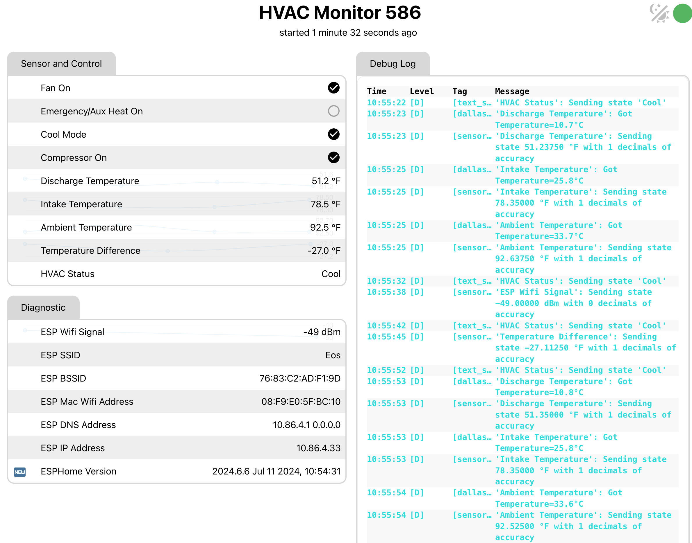

# HVACMonitor: Project to Monitor My HVAC System

I live in Florida and that means rising temperatures in the summer, along with surging electric bills for cooling.

A couple years back, my air conditioner had trouble keeping up with the hotter temperatures and seemed to run all the time.  By the time I got a technician out to look at it, most of the coolant had leaked out.  Refilling it was a big expense.  That got me thinking that I needed a better way to understand how the system was working.

Fresh off an ESPHome/Homeassistant project to monitor my home alarm system, I went looking for a solution.

I came across [Jim Shank's](https://github.com/jshank) great [AC Watcher project](https://github.com/jshank/ACWatcher/blob/main/README.md).  I used a number of his ideas that got this project moving much more quickly.  Thank you Jim!

Some of my functional goals:
- Monitor the current state of the HVAC system: heat/cooling, fan on/off, compressor on/off
- Monitor the effectiveness by sampling intake and discharge temperatures
- Monitor the temperatures where all that cold air runs through ducts sitting in a hot attic
- Monitor the power consumption of the whole system - compressor and air handler
- Minimal changes to the HVAC system, and nothing that would void any warranties.

I ended up building this in several parts:
- An ESPHome-based monitor for everything other than power consumption
- A commercially available power monitor I could install in my breaker panel to capture the compressor and air handler power consumption.  More on this later.
- Homeassistant to provide visibility and additional, statstical, information

## Table of Contents
- [HVACMonitor: Project to Monitor My HVAC System](https://github.com/czsmith/HVAC-Monitor/edit/main/README.md#hvacmonitor-project-to-monitor-my-hvac-system)
  - [Current Information from the ESPHome on the HVAC Monitor board](https://github.com/czsmith/HVAC-Monitor/edit/main/README.md#current-information-from-the-esphome-on-the-hvac-monitor-board)
  - [Full Information in Homeassistant](https://github.com/czsmith/HVAC-Monitor/edit/main/README.md#full-information-in-homeassistant)
  - [Accessing HVAC State](https://github.com/czsmith/HVAC-Monitor/edit/main/README.md#accessing-hvac-state)
  - [HVAC Monitor Board](https://github.com/czsmith/HVAC-Monitor/edit/main/README.md#accessing-hvac-state)
    - [Design Tools]
  - [The Build](https://github.com/czsmith/HVAC-Monitor/edit/main/README.md#the-build)
    - [Identifying Signal Wires](https://github.com/czsmith/HVAC-Monitor/edit/main/README.md#identifying-signal-wires)
    - [Wiring](https://github.com/czsmith/HVAC-Monitor#wiring)
    - [Double Check](https://github.com/czsmith/HVAC-Monitor#double-check)
  -   [Bench Setup](https://github.com/czsmith/HVAC-Monitor#adjust-voltage)
    - [Adjust Voltage](https://github.com/czsmith/HVAC-Monitor#adjust-voltage)
    - [Assemble the Temperature Probes](https://github.com/czsmith/HVAC-Monitor#adjust-voltage)
  - [ESPHome Software for the Monitor Board](https://github.com/czsmith/HVAC-Monitor#esphome-software-for-the-monitor-board)
    - [Basic Setup](https://github.com/czsmith/HVAC-Monitor#basic-setup)
    - [Define the Probe Sensors](https://github.com/czsmith/HVAC-Monitor#define-the-probe-sensors)
    - [Finding the Temperature Probe Address](https://github.com/czsmith/HVAC-Monitor#finding-the-temperature-probe-address)
    - [Derive a Sensor for the Difference Between Intake and Discharge Temperatures](https://github.com/czsmith/HVAC-Monitor#derive-a-sensor-for-the-difference-between-intake-and-discharge-temperatures)
    - [Define Sensors for the State of the HVAC](https://github.com/czsmith/HVAC-Monitor#define-sensors-for-the-state-of-the-hvac)
    - [Diagnostic Sensor](https://github.com/czsmith/HVAC-Monitor#diagnostic-sensor)
    - [Derive a Sensor to Provide Overall HVAC Status](https://github.com/czsmith/HVAC-Monitor#derive-a-sensor-to-Provide-Overall-HVAC-Status)
  - [Programming the HVAC Monitor Board](https://github.com/czsmith/HVAC-Monitor#programming-the-hvac-monitor-board)
  - [Testing the HVAC Monitor Board](https://github.com/czsmith/HVAC-Monitor#testing-the-hvac-monitor-board)
    - [Check Temperature Probes](https://github.com/czsmith/HVAC-Monitor#check-temperature-probes)
    - [Check State Sensor Inputs](https://github.com/czsmith/HVAC-Monitor#check-state-sensor-inputs)
  - [Connect the HVAC Monitor Board to Your HVAC System](https://github.com/czsmith/HVAC-Monitor#connect-the-hvac-monitor-board-to-your-hvac-system)
    - [Install the Temperature Probes](https://github.com/czsmith/HVAC-Monitor#install-the-temperature-probes)


## Current Information from the ESPHome on the HVAC Monitor board
The HVAC Monitor board has an on-board web server to show basic, current state information.



## Full Information in Homeassistant
Homeassistant has many more capabilities to create additional views and enrich the sensor data from the HVAC monitor board. It also integrates data from other sensor devices into a complete view of the HVAC system. In this view Homeassistant is computing run times and is merging data from the HVAC Monitor board and the power monitor in the breaker panel.


Homeassistant can pull data collected over time and provide graphical displays:


In this case, when the compressor was running at top and what the ambient temperature was in the attic at the same time. Data is pulled from the past five days.


## Accessing HVAC State
In a traditional heap pump scenario, all the information about the state is available by monitoring the signals from the thermostat to the HVAC system.

A typical heat pump HVAC system is controlled by a thermostat which receives power form the air handler and sends control signals to the air handler and the compressor as illustrated below:


The signals to control the compressor (whether one or two stages), fan, auxillary heater and heat/cool mode are present as 0VAC or 24VAC on the connection between the thermostat and the air handler.  I tapped this cable, outside of the air handler, to get access to the HVAC state.  So I just picked up some thermostat wire (8/18 guage) at my local big box store and accessed the signals in my attic:


**NOTICE: OF COURSE,  YOU NEED TO DETERMINE THE CONFIGURATION FOR YOUR PARTICULAR SYSTEM.  THESE ARE COMMON FOR POPULAR HONEYWELL THERMOSTSATS.**

**IT IS ALSO CRITICAL FOR THIS IMPLEMENTATION THAT THE POWER NOT EXCEEED 30VAC.**

**THIS DESIGN IS FOR HVAC SYSTEMS WITH ONE OR TWO STAGE COMPRESSORS AND ONE OR TWO STAGE HEATING**

## HVAC Monitor Board
The HVAC monitor is built using a WEMOS D1 Mini ESP develpment board, running ESPHome.  


The main blocks are:

- Power supply to convert the 24 to 28 VAC power to 5VDC.  For this, we take power from the power and common signals (red an blue in my case) and run it through a rectifier and into a LM2596S DC-DC buck converter.  Since 28VAC peaks at 40VDC and this device is rated for 12 to 40VDC, I added two diodes to drop the incoming DC volatage by 2-3V.  
Also, during development, I like to power the monitor with a USB port so there's a jumper to disconnect the output of the buck converter from the 5V input on the ESP board. When pins 1&2 are jumpered, power is provided externally. When not jumpered, a USB cable plugged into the ESP board provides power.

- Signal conditioners to isolate the input AC signals and convert them to levels the ESP can handle.  I'm using 4N35 opto isolators, but any similar part would be fine. (I had a bunch lying around from a prior project). Since these are DC devices, a diode is needed along with the resistors to reduce the input current.  If you use an AC opto isolator, the diode isn't necessary.
There are two "common" terminals, one for the sensors and one for the power source. Jumping pins 1 and 2 connect these.  This allows a separate power source from the thermostat. **BUT NOTE: the commons are connected in the LM2596S buck converter, so a separate floating power source is required if you use this option.**
Also note that two-stage heat pumps have second a signal to the compressor.  In this design, just wire both signals to the Compressor and Compressor2 inputs. HVAC Monitor only reports one compressor state regardless of which compressor input is asserted.

- Interface to Dallas DM18B20 type temperature sensors. This is a one-pin interface. The sensors use 3.3V, ground and a shared signal bus to send temperature readings. The probes for the intake, discharge and ambient temperatures can be connected with either a 4-pin header or KF2510 connectors. It doesn't matter which connector is used; probes are identified by address, not connector.

- WEMOS D1 Mini board.

Since the control signals are AC, they need to be converted to DC for the ESP.  But they're also 60HZ, so if the opto output were fed directly to the ESP, it'd be triggering 120 times per second on each active line.  Software debouncing could address that problem, but I used a hardware solution. A 4.7uF capacitor is connected to the opto output with a high pull-up resistor. When the AC signal is asserted, the capacitor is discharged through the isolator producing a low input.  Before the next cycle, the voltage only builds up to about 500mV, which continues to read as a low signal by the ESP.  Feel free to play around with different capacitor and resistor values.

### Design Tools
Schematics were captured with EasyEDA, a free schematic capture and PCB design product which is aviliable online via browser or can be installed on a Windows, Mac or Linux machine.

My first prototype was all hand wired on three pad-boards. Needing to make another, I used the EasyEDA PCB layout tool to create a two-layer PC board.  For a very small amount of money and about 2 weeks, NextPCB.com delivered 5 boards.


You'll find the schematic and Gerber files in the Github repository.

## The Build

### Identifying Signal Wires
We will need to connect the main signals from the thermostat to the HVAC system.  The first step in this is to identify which wires carry which signals.

The best place to start is always with the documentation for your thermostat and air handler.  Get the model numbers and look them up on the internet.  This should give the best starting point. If you are willing, a peek inside the air handler will allow you to quickly identify the Power and Common wires.

In my system, with a Honeywell FocusPRO® TH5000 thermostat, the signals are:
| Color  | Purpose                                                  | When High relative to Common |
| ------ | -------------------------------------------------------- | ---------------------------- |
| Red    | Power.  24-28 VAC - Power thermostat and HVAC Monitor    | Always high               | 
| Blue   | Common                                                   | Never high                   |
| Yellow | Contactor - Compressor main (or only) stage              | Compressor on                |
| Orange | Changeover - Selects heat or cool mode                   | Depends on thermostat / compressor |
| Green  | Fan                                                      | Fan on                       |
| White  | Auxillary / Emergency heat                               | Heater coils on              |


After that, we need to tap into the cable carrying these signals.  Playing with the thermostat and putting the system into various modes should allow us to identify all the signal wires.  The following table shows the most likely outcome for various settings on the thermostat to aid in figuring which wire carries which signal. 

**NOTE: THIS WORKED FOR ME AND SHOULD WORK, IN GENERAL.  ALWAYS USE YOUR OWN JUDEGEMENT. THE PROCESS IS NOT GUARANTEED. DO THIS AT YOUR OWN RISK.**

Put your voltmeter on the AC setting.

Most likely, your thermostat uses an almost-standard color scheme.  See [here](https://www.aireserv.com/about/blog/2020/february/the-thermostat-wire-color-code-you-need-to-know/) for an explanation.

The first task is always to locate the Common and then the Power wires. With the thermostat in the OFF position and the Fan on Auto, look for the two leads, in any combination, that produce 24-28VAC. Use any documentation as guideance. It definitely pays to start with the red lead as the main power source and blue or black as the Common.  

One complication in identifying wires is that fact that there is no particular standard for the Reverse signal. On some compressors, a HIGH reverse signals cooling mode and on some it signifies heating mode.  Thus it's possible that in searching for the Power and Common wires, you'll test the Reverse wire against Common and also get a HIGH reading. But it will become clear which is Power and which is Reverse once you change the system from heating to cooling mode.

Once you've found the common wire, this table should help you identify (or confirm) the other signals by checking voltage against the Common:

| Condition or Setting |  Compressor | Fan | Cool/Heat   | Aux/Emer Heat | Notes |
| -------------------- |  ---------- | --- | ----------- | ------------- | ----- |
|(1) TH OFF               |  LOW        | LOW | LOW or HIGH | LOW          | All LOW except Power and maybe Reverse (Cool/Heat+
|(2) TH on COOL, not cooling, Fan Auto  |  LOW        | LOW | LOW or HIGH | LOW           | All LOW except Power and maybe Reverse
|(3) TH on HEAT  not heating, Fan Auto   |  LOW        | LOW | Changed from (2) | LOW           | The Reverse signal hould be the opposite of the previous casae |
|(4) TH HEAT not heating, Fan on MANUAL |  LOW        | HIGH | Same as (3)| LOW         | Only the FAN signal should change from the previous case.
|(5) TH COOL, cooling on     | HIGH      | HIGH | Same as (2) | LOW          | Only the compressor should change since the fan was already on |
|(6) TH HEAT, heating on     | HIGH      | HIGH | Same as (3) | LOW          | Only the reverse (heat/cool) shold change
|(7) TH HEAT, force AUX   | HIGH      | HIGH | Same as (3) | HIGH         | Only the Aux/Emergency setting should change
|(8) TH HEAT, Emergency   | HIGH or LOW | HIGH | Same as (3) | HIGH        | Depends on system. Usually Emergency is coils-only and compressor is turned off

This process sounds complicated, but it really goes quickly, especially if you find that your system uses the "standard" colors and they check out with your meter.

### Wiring
It's pretty straightforward to build this by hand using perf or pad boards.  Sadly, I didn't have a board big enough, so I ended up building it on 3 boards that had to be wired togethee.  


If you're going to wire this by hand, I stronglyl suggest using a big enough board to fit everything and generally using the layout tht the PCB uses.  If you wish to make a PC board, you should be able to get 5 for less than $10 from nextpcb.com.  Either use the existing Gerber files, or import the schematic from Github, make your part changes (including proper footprint selection), generate a new PCB and submit it for fabrication to the company of your choice.

It might make sense not to install the ESP right away - the rest of the board can be checked out and the power supply adjusted without risking this part.

### Double Check
I shouldn't have to say this, but always double-check your wiring by buzzing out the board.

## Bench Setup
At first, it's best to connect the ESP to your computer via USB port.  This will allow for ESP to be programmed for the first time.  Over the Air (OTA) updates are possible after that.

### Adjust Voltage
It helps to have a 24-28VAC power source on your workbench for the initial setup and testing. I happen to have a 24VAC wall wart from some old product.  If you dont, you might try putting three 9-volt batteries in series and using that.  (It won't matter which way you connect them to the Power and Common terminals.)

The buck converter, when shipped, generally outputs the input voltage.  **ALWAYS, ALWAYS adjust the power supply output to 5V before connecting the ESP to the power supply.**

If the ESP is not yet installed, just power the board from the external source. If the ESP is installed, move jumper J2 to the INTERNAL power position (remove jumper or place on pins 2-3) to isolate it from the external power supply and buck converter.  

With the external power source attached to the screw terminals, adjust the screw potentiameter until the output voltage on the buck converter reads 5V.

### Assemble the Temperature Probes
Jim Shank gives a great description how to assemble the temperature probes.  Refer to his [project documentation](https://github.com/jshank/ACWatcher/blob/main/README.md#temperature-probes) for details.  I'll summarize here, but be sure to read Jim's description for the details.

The recommended probes are based on the Dallas DS18B20S temperature sensor. These are readily available on [amazon])https://www.amazon.com/dp/B0CP7S6HXW?ref=ppx_yo2ov_dt_b_product_details&th=1) or [aliexpress](https://www.aliexpress.us/item/3256804339655077.html?spm=a2g0o.productlist.main.65.306c1741YggZhg&algo_pvid=7e022bad-0095-4385-af6c-89916a5df688&algo_exp_id=7e022bad-0095-4385-af6c-89916a5df688-32&pdp_npi=4%40dis%21USD%210.90%210.90%21%21%210.90%210.90%21%40210318ec17206721002124591efab9%2112000029476974460%21sea%21US%214591625309%21&curPageLogUid=2cat5twrARNc&utparam-url=scene%3Asearch%7Cquery_from%3A).  Do consider the distance from your HVAC monitor board to where you will insert the probe.  I'd ordered probes with 1 meter cords and found out that I'd have been better off with 2 or 3 meter cords.  Just had to make some extension cables.

The probes are attached to the end of stainless steel straws with heat shrink tubing to keep the sensor in place.  This gives enough length for the sensors to be placed in the center of airflow in the duct.


I've connected probes with both 4-pin male headers or 3-pin male connectors. When using a 4-pin header, pin 1 is red (power), pin 2 is clipped off, pin 3 is data (yellow) and pin 4 is ground (black).  To ensure proper orientation, I plug pin 2 on the female header on the board.  If you use the 3-pin connector (which is polarized), pins 1-3 are red, yellow and black, respectively.


## ESPHome Software for the Monitor Board
ESPHome provides all the software functionality on the HVAC Monitor board.  If you've never used ESPHome, it's time to wander to the [ESPHome site](https://esphome.io/) and get familiar with it.

The full ESPHome configuration YAML files are in the Github repository.  I'll present parts of the configuration file(s) separately to better explain their function.

Note: Since I need more than one HVAC Monitor, I've split the configuration file into site-specific files which include a separte file which has all the common YAML.

### Basic Setup
All ESPHome project configurations need some standard setup. One file hold the site-specific parameters:

```
# Build an HVAC Monitor for 586

substitutions:
  name: "hvac586"                   #unique network name, system name
  friendlyName: "HVAC Monitor 586"  #used as the friendly name of your application in HomeAssistant
  discharge_sensor_address: "0x8831f0d446c64d28"
  intake_sensor_address: "0x9831bcd446d98028"
  ambient_sensor_address: "0x6e3845d446455e28"    
<<: !include HVACMonitorCommon.yaml
```
In the common HVACMonitorCommon.yaml file, we have the usual ESPHome declarations and setup:
```
esphome:
  name: $name
  friendly_name: $friendlyName
# output sympols to output.map for debugging. you can remove if not needed
  platformio_options:
    build_flags: 
        - "-Wl,-Map,output.map"

# Identify our ESP development board
esp8266:    
  board: nodemcuv2
  framework:
    version: recommended

# Specify which wifi network to connect to and provide a local SSID if we can't connect
wifi:
  ssid: !secret wifi_ssid
  password: !secret wifi_key

  ap:
    ssid: "$name"
    password: !secret HVAC_ap_wifi_key

# Enable logging
logger:
  baud_rate: 115200
  level: debug

# Specify the encryption key for Homeassistant access.
api:
   encryption:
      key: !secret HVAC_apikey

# Enable Over-the-Air updating
ota:
  platform: esphome 
  password:  $HVAC_ota_password

# Get time and date automatically
time:
 - platform: sntp

# Enable on-board web  server to view sensor status and log
web_server:
  port: 80
  ota: false
  version: 3
```

As is common with ESPHome projects, a separate secrets.yaml file holds all the "secret" passwords and encryptinn keys.

### Define the Probe Sensors
Sharing a 1-wire bus, they are polled by ESPHome by address.  We need to set up two ESPHome components: the 1-wire bus and the actual temperature sensors.

The bus and Dallas protocol driver is configured:
```
one_wire:
  - platform: gpio
    pin: D2
    id: dal
```
This loads the 1-wire driver and tells it to use ping D1 on our ESP device.  We assign the bus id "dal" which will be used in sensor definitions to tie the temperature driver to the right bus.

Three temperature sensors are defined:
```
# Individual sensors
sensor:
  - platform: dallas_temp
    address: $discharge_sensor_address # No Tape to mark the sensor
    id: discharge_temp
    name: "Discharge Temperature"
    unit_of_measurement: "°F"
    update_interval: 30s
    filters:
      - offset: 0.0
      - lambda: return x * (9.0/5.0) + 32.0;
   
  - platform: dallas_temp
    address: $intake_sensor_address # Blue Tape on the sensor
    id: intake_temp
    name: "Intake Temperature"
    unit_of_measurement: "°F"
    update_interval: 30s
    filters:
      - offset: 0.0
      - lambda: |-
          return x * (9.0/5.0) + 32.0;

  - platform: dallas_temp
    address: $ambient_sensor_address # Red tape on the sensor
    id: ambient_temp
    name: "Ambient Temperature"
    filters:
      - lambda: return x * (9.0/5.0) + 32.0;
    unit_of_measurement: "°F"
    update_interval: 30s
```
Each temperature probe has a unique address. Since I want to have multiple monitor boards I've put the actual addresses in the per-board configuration file in the variables $discharge_sensor_address, $intake_sensor_address and $ambient_sensor_address. To start with, I give them sequential address like 0x0100000000000000 and 0x0200000000000000.

These sensors return the temperature in degrees Celcius.  For those wanting readings in degrees Farenheit, we have a lambda filter which converts from Celcius to Farenheit.

A polling interval is set at 30 seconds.  Note that the sensors are polled independently and, after a while, will not update simultaneously.

The sensors I received were quite accurate and did not need any calibration. If yours don't match with a reliable thermometer at various temperatures, refer to the ESPHome [sensor documentation](https://esphome.io/components/sensor/) for plenty of calibration options.

### Finding the Temperature Probe Address
Sadly, the probes do not have their addresses printed on them so we need to discover them.

The only way to get the address is to connect one probe at a time and look at the log messages.  
At board startup, the one_wire driver display the address for each probe found.  There'll be log messages like:
```
[10:15:52][C][gpio.one_wire:020]: GPIO 1-wire bus:
[10:15:52][C][gpio.one_wire:021]:   Pin: GPIO4
[10:15:52][C][gpio.one_wire:080]:   Found devices:
[10:15:52][C][gpio.one_wire:082]:     0xa94152d446ab5d28 (DS18B20)
```
Note down the address and update the substituion variable for the right sensor in the per-devcie configuration file.  Do this for all probes one at a time.  Once all the probes have been identified, they can all be plugged in.

If you miss this message at boot time, you can temporarily change the lambda filter on one of the sensors to be:
```
    filters:
      - offset: 0.0
        id(dal).dump_config();
      - lambda: return x * (9.0/5.0) + 32.0;
```
This will force a diplay of all sensors every time that sensor is polled.

### Derive a Sensor for the Difference Between Intake and Discharge Temperatures
Using ESPHome's template capability, we define a virtual sensor which whill show the difference between the intake and discharge temperatures. After the above three entries, add:
```
  - platform: template
    name: "Temperature Difference"
    id: temp_difference
    update_interval: 30s
    unit_of_measurement: "°F"
    lambda: |-
      return (id(discharge_temp).state - id(intake_temp).state);
```
This creates a "sensor" with the name Temperature Difference and is calculated as the difference in displayed temperatures.  Again, if you want to report temperatures in Celsius, change the "unit_of_measurement" setting.

### Define Sensors for the State of the HVAC
The HVAC signals are connected to four GPIO pins of our ESP.  We define four binary sensors to track the state of those inputs.
```
binary_sensor:
  - platform: gpio
    name: "Fan On"
    pin: 
      number: D1
      inverted: true
      mode:
        input: true
        pullup: false
    filters:
      - delayed_on: 100ms
      - delayed_off: 100ms          
    device_class: running
    
  - platform: gpio
    name: "Emergency/Aux Heat On"
    pin: 
      number: D5
      inverted: true
      mode:
        input: true
        pullup: false
    filters:
      - delayed_on: 100ms
      - delayed_off: 100ms          
    device_class: running

  - platform: gpio
    name: "Cool Mode"
    pin: 
      number: D6
      inverted: true
      mode:
        input: true
        pullup: false
    filters:
      - delayed_on: 100ms
      - delayed_off: 100ms          
#    device_class: None

  - platform: gpio
    name: "Compressor On"
    pin: 
      number: D7
      inverted: true
      mode:
        input: true
        pullup: false
    filters:
      - delayed_on: 100ms
      - delayed_off: 100ms          
    device_class: running
```
The Cool sensor is displays On/Off states because we accepted the default device_class.  The other three sensors display "Running" and "Not RUnning" because we set the display_class to "running."

The filters provide some debounce in case of spurious signals.

### Diagnostic Sensor
To monitor the overall health of the HVAC Monitor board, a few additional sensors are configured.  These will show up as 'Diagnostic" values.

In the section with the temperature probles (the "sensors:), we add a sensor to report the wifi signal level:
```
  - platform: wifi_signal
    name: "ESP Wifi Signal"
```
Additional information about the board is added to a new "text_sensor" section:
```
text_sensor:
  - platform: wifi_info
    ip_address:
      name: ESP IP Address
    ssid:
      name: ESP SSID
    bssid:
      name: ESP BSSID
    mac_address:
      name: ESP Mac Wifi Address
    dns_address:
      name: ESP DNS Address

  - platform: version
    name: "ESPHome Version"
```
### Derive a Sensor to Provide Overall HVAC Status
It's useful to have a single entity we can look at to tell us the overastate of the HVAC system.  This should parallel what we see when we look at the thermostat. Define the new sensor as a templage text sensor:
```
# Device status:
#   Cooling: Compressor On, Cool Mode On
#   Heating: Compressor On, Cool Mode Off, Emergency/Aux Heat Off
#   Aux Heat: Compressor On, Cool Mode Off, Emergency/Aux Heat On
#   Fan: Compressor Off, Fan On
#   Off:  Compressor Off, Fan Off

  - platform: template
    name: "HVAC Status"
    id: hvac_status
    update_interval: 30s
    lambda: |-
      if (!id(hvac_compressor_on).state) {
        // Compressor not running.  Either "OFF" ofr "FAN"
        if (id(hvac_fan_on).state) {
          return {"Fan"};
        } else {
          return {"Off"};
        }
      } else {
        // Compressor is running.. Figure cool or heating
        if (id(hvac_cool_on).state) {
          return {"Cool"};
        } else {
          if (id(hvac_auxemer_on).state) {
            return {"Aux Heat"};
          } else {
            return {"Heat"};
          }
        }
      }
```
Since the status is a text value, this is placed in the "text_sensor:" section of the config file.

## Programming the HVAC Monitor Board
Once the configuration files are complete (including a secrets.yaml file), compile the per-device yaml file.  I have a Mac, so my command line command is:
```
   esphome compile <your main configuration yaml filename>
```
In my case, it'd be:
```
   esphome compile HVACMonitor586.yaml
```
Fix any errors which occur.  When you're ready to configure the ESP for the first time, set the board to run on internal power (External Power pins to position 2&3).  Plug in a USB cable and run the command:   
```
   esphome run <your main configuration yaml filename>  
```
Of course, use the real file name for your setup.

After the first time loading the firmware, you can disconnect the USB and update the firmware OTA.

## Testing the HVAC Monitor Board
Once the board is programmed and running, you can do some additional bench testing before connecting it to your HVAC system.

It's helpful, when doing the testing, to connect both to the on-board web server and monitor the logs remotely.  To connect to the web server, simply browse to its IP address.

To access the logs, run the following from the command line:
```
   esphome logs <your main configuration yaml filename>
```
### Check Temperature Probes
One at a time, put the probe in one or two glasses of water with different temperatures.  Make sure you get the right temperature on the right probe.  These probles do not respond instantly, so allow a minute or two for the tmperature to stabilize.

### Check State Sensor Inputs
Run this test with external power.  If you are using a DC power supply, make sure that:
- The Power header is using External power (pins 1 and 2 jumpered)
- The Common input is shared (pins 1 and 2 are jumpered)
- If you are using a DC power source, make sure PWR is connected to positive voltage and COM to negative.

Connect a jumper from the PWR to each input screw.  There should be an ON message in the log and the web interface should show On or Running for that input when you connect and an OFF message when you disconnect.

## Connect the HVAC Monitor Board to Your HVAC System
I strongly recommend that you turn off the HVAC system at the breaker box.  If you accidentally short any of the thermostat wires, you may blow the fuse (at best) which will require opening the air handler and replacing it. **NEVER OPEN THE AIR HANDLER WITH THE POWER ON**

## Install the Temperature Probes
Refer to Jim's [probe documentation](https://github.com/jshank/ACWatcher/blob/main/README.md#temperature-probes) for how and where to install the probes.

## ESPHome Portion Done
You should now have a usable HVAC monitor with a web interface.

To get a deeping understanding of your system, you'll need to run Homeassistant and do soe additional configuraiton.


=====================================================================================================================================


HVAC continues to be one of the highest energy devices in our household yet even the more advanced systems don't contain monitoring or alerting components to let you know when something isn't working correctly. This can be both frustrating and costly. Modern cooling systems will run the fan and compressor continuously, even if they aren't working properly. This solution aims to provide a simple and cost effective way of monitoring the performance of your system and alerting you when there are problems. 

There are 3 components:
- ACWatcher
	- An ESP based device installed near your HVAC system to monitor the state of the system (system active, intake temperature and discharge temperature)
- ESPHome
	- The firmware running on ACWatcher to send sensor output to Home Assistant
- Home Assistant
	- Central home automation system capable of integrating with hundreds of IoT solutions
	- Tracks historical performance
	- Alerts to abnormal operating conditions

## Table of Contents
- [Solution to monitor the performance of an HVAC system](#solution-to-monitor-the-performance-of-an-hvac-system)
  - [Table of Contents](#table-of-contents)
  - [Disclaimers and Legal Stuff First](#disclaimers-and-legal-stuff-first)
  - [AC Watcher](#ac-watcher)
    - [BOM](#bom)
    - [Enclosures & Mounts](#enclosures--mounts)
    - [Assembly](#assembly)
  - [ESPHome](#esphome)
    - [Full configuration](#full-configuration)
    - [Finding the temperature sensor addresses](#finding-the-temperature-sensor-addresses)
    - [Calibrating the CT Clamp](#calibrating-the-ct-clamp)
  - [Temperature Probes](#temperature-probes)
    - [Temperature Probe Installation](#temperature-probe-installation)
    - [Final Mounting](#final-mounting)
  - [Home Assistant](#home-assistant)
  - [Possible Improvements](#possible-improvements)

## Disclaimers and Legal Stuff First
As an Amazon Associate I earn from qualifying purchases. I get commissions for purchases made through links in this post. Working with electricity is dangerous and can cause personal injury or DEATH as well as other property loss or damage if not used or constructed properly. If you have any doubts whatsoever about performing do-it-yourself electrical work, PLEASE do the smart thing and hire a QUALIFIED SPECIALIST to perform the work for you.

NEVER WORK WITH LIVE VOLTAGE. Always disconnect the power source before working with electrical circuits.

## AC Watcher
For my installation, I used an ESP8266 based Wemos D1 Mini Pro. I [modified](https://youtu.be/hXRcJXMjlyg?t=111) the antenna jumper to utilize the external antenna since the unit was installed in the garage. The Wemos D1 Mini is compact while providing a single ADC to capture current (is the system running) and multiple GPIOs to communicate with the temperature probes.
### BOM
| Qty | Device                                                     | URL                     |
| --- | ---------------------------------------------------------- | ----------------------- |
| 1   | Wemos D1 Mini Pro                                          | https://amzn.to/3xFy5fR |
| 2   | Dallas 1-wire temperature probes                           | https://amzn.to/3xP2s3L |
| 1   | Stainless Steel Straws                                     | https://amzn.to/3HeELol |
| 1   | YHDC Split Core Current Transformer Non-invasive SCT013-03 | https://amzn.to/3aVo3OQ |
| 1   | 40x60mm Perf Board                                         | https://amzn.to/39kikS4 |
| 2   | 10kOhm  1/4 Watt THT Resistors                             | https://amzn.to/3NIqNxz |
| 1   | 4.7kOhm  1/4 Watt THT Resistors                            | https://amzn.to/3zBT1G6 |
| 1   | 10uF 25v Electrolytic Capacitor                            | https://amzn.to/3xj8AQ9 |
| 2   | 3-pin PCB mount 5mm terminal block connectors              | https://amzn.to/3O9zOzy |
| 1   | 3.5mm female jack breakout board                           | https://amzn.to/3tssQgU | 

**Tools**: Soldering iron, solder, shrink tubing and wires

### Enclosures & Mounts

It helps significantly to have a 3d printer but you can always used shapeways.com or ask a friend to print these for you.

- [ACWatcher Case](3dfiles/Case.3mf)
- [ACWatcher Case Lid](3dfiles/Lid.3mf)
- 2 x [Temp Probe Mount](3dfiles/Temp%20Probe%20Holder.3mf)

### Assembly
Follow the diagram below to solder the main part into the perf board, making sure you adhere to the schematic.

**Schematic Wiring Diagram (From below)**


**Top of perf board**


**ACWatcher Schematic**


Make sure to check all of your connections with a multimeter before you put it in the case. I also recommend getting ESPHome installed and working before putting it in the enclosure.

## ESPHome

Installing and configuring ESPHome is beyond the scope of this article, check out the great documentation over at https://esphome.io/

### Full configuration
Use the following configuration for your device replacing the wifi_ssid and password as well as your own IP ranges.

```
esphome:
  name: acwatcher

esp8266:
  board: d1_mini_pro

# Enable logging
logger:

# Enable Home Assistant API
api:
  encryption:
    key: "generated_by_the_system"

ota:
  password: "generated_by_the_system"

wifi:
  ssid: !secret wifi_ssid
  password: !secret wifi_password
  manual_ip:
    static_ip: 10.1.12.239
    gateway: 10.1.12.1
    subnet: 255.255.255.0

  # Enable fallback hotspot (captive portal) in case wifi connection fails
  ap:
    ssid: "Acwatcher Fallback Hotspot"
    password: "generated_by_the_system"

captive_portal:

globals:
   - id: hvac_on_threshold
     type: float
     restore_value: no
     initial_value: '2.00' # Update this to ~1/2 the amperage of the ON value of your HVAC

dallas:
  - pin: D4
  
# Individual sensors
sensor:
  - platform: dallas
    address: 0x51000005d3a58b28 # Replace with your address
    id: discharge_temp
    name: "Discharge Temperature"
    filters:
      - lambda: return x * (9.0/5.0) + 32.0;
    unit_of_measurement: "°F"
    
  - platform: dallas
    address: 0x0e000005d3516128 # Replace with your address
    id: intake_temp
    name: "Intake Temperature"
    # Green band
    filters:
      - lambda: return x * (9.0/5.0) + 32.0;
    unit_of_measurement: "°F"
    
  - platform: ct_clamp
    sensor: adc_sensor
    id: hvac_current
    name: "HVAC Current"
    update_interval: 1s
    filters:
      - calibrate_linear:
        - 0 -> 0
        - 0.052 -> 4.3 # Replace with your CT clamp calibration 
    
  - platform: adc
    pin: A0
    id: adc_sensor
    
  - platform: template
    name: "Delta T"
    id: temp_delta_t
    update_interval: 60s
    unit_of_measurement: "°F"
    lambda: |-
      return (id(intake_temp).state - id(discharge_temp).state);

    
binary_sensor:
  - platform: template
    name: "HVAC State"
    lambda: |-
      if (id(hvac_current).state > id(hvac_on_threshold)) {
        return true;
      } else {
        return false;
      }
```

### Finding the temperature sensor addresses
Connect the temperature probes to the screw terminals and then power up the ACWatcher with a USB connection that allows you to view the debug logs. Shortly after startup, you should see 2 different device addresses. You will replace my device addresses with your own:

```
[20:05:51][C][dallas.sensor:075]: DallasComponent:
[20:05:51][C][dallas.sensor:076]:   Pin: GPIO2
[20:05:51][C][dallas.sensor:077]:   Update Interval: 60.0s
[20:05:51][D][dallas.sensor:082]:   Found sensors:
[20:05:51][D][dallas.sensor:084]:     0x0e000005d3516128 <--Here is the address of the temp sensor!
[20:05:51][D][dallas.sensor:084]:     0x51000005d3a58b28 <--Here is the address of the other temp sensor!
```

Replace the addresses and then restart again. Make sure you know which one is which. I used a piece of green shrink wrap on one and black on the other to differentiate. You can always just swap the addresses in the configuration if you get it wrong. 

At this point, you can insert the intake probe through the space where your air filter goes. You can use some electrical tape to temporarily attach the discharge probe to the vent, about 2-ft above the cooling coils. Power up your ACWatcher and watch the output in the logs to confirm you are seeing a decent difference in temperature while running the system. 
### Calibrating the CT Clamp 
Follow the excellent tutorial at https://esphome.io/components/sensor/ct_clamp.html#calibration for calibrating your CT Clamp. I recommend starting with a known good load (like a incandescent lightbulb) to calibrate your clamp. Precision isn't very important since we're only interested in finding out if the device is on or off.


Now that the clamp is calibrated. Open up your HVAC service cover and look inside for the electrical wiring. Look for the black wire, which should be thicker and clip the CT Clamp around it. Once again, check the logger output from ESPHome to make sure you are seeing an increase in current when the blower turns-on. Once you are fully calibrated, update the `hvac_on_threshold` variable to ~1/2 of the "on" value of your HVAC system. 

## Temperature Probes
I took a cue from the Honeywell HZ322 controller and designed a temperature probe similar to their solution. 3d print two of the [temperature probe holders](3dfiles/Temp%20Probe%20Holder.3mf). Make sure the holes are clear using a drill bit because you will want the **Stainless Steel Straw** to fit tightly. Depending on the depth of your vent, you may want to cut down the straw using a [tubing cutter](https://amzn.to/3Hf0BYM). If you do cut to tube, make sure to clean up the ends so you don't cut the cable while feeding it through. Next, press the straw into the temperature probe holder. Once I had it started, I placed the straw end flat on my work bench and pressed down hard until it was seated. Now feed the temperature probe through the straw and out the smaller hole in the back of the temperature probe holder. The finished product should look something like this.  


If everything looks correct, draw the temperature probe cabling into the body of the straw and then put another piece of shrink tubing on to stabilize the probe. Here is a view of the fully assembled probe, from inside the air return space.


Wire everything up again and make sure the probes are working correctly before the next step.

### Temperature Probe Installation
Starting with the intake probe, locate a portion of the duct work or blower/furnace mounting pedestal. Making sure you don't damage anything inside the space, drill a 1/4" hole into the area and slide the probe in. You can see my location in the image above coming through the sheetrock below my HVAC blower, just in front of the main air return for the house. Insert the probe and affix with two appropriately sized screws.

For the discharge probe, you will want to place the probe a few feet away from the blower to avoid damaging the probe when the heat is in use. Check out the [Honeywell DATS manual](https://manuals.plus/honeywell/c7735a1000-duct-air-temperature-sensor-manual) for guidance. You're likely going to be drilling into the duct work so carefully examine where you are drilling and make sure you won't damage anything inside the space. Carefully drill a 1/4" hole, just enough to penetrate the duct without the bit going too far in. Use a flashlight and make sure the space is clear before inserting the probe. If the hole looks good, place the probe into the hole and mark or drill two smaller holes for the temperature probe mount screw holes on either side of the main probe. Use sheet metal screws to affix the temperature probe mount to the duct work. One last time, connect it all up and check that everything is still working properly. 


### Final Mounting

At this point, find a good place to mount the ACWatcher, preferably not directly on the HVAC unit to avoid temperature problems. You can easily extend the temperature probe cabling up to ~50-ft without issue if needed. I used double-sided mounting tape but included an updated enclosure that has mounting tabs. 

## Home Assistant
Home Assistant has native access to ESPHome devices through the integrations panel. Take a look at https://esphome.io/guides/getting_started_hassio.html for details. Once the integration is configure properly, in Home Assistant, go to **Settings** -> **Add Integration** - **ESPHome** and enter the IP address of the ACWatcher. If you kept the same device names as I did in the device configuration, the following automation will work for you.

```
- id: cooling_problems
  alias: "Notify Cooling Problems"
  trigger:
    - platform: numeric_state
      entity_id: sensor.delta_t
      below: 15
      for: "00:10:00"
  condition:
    condition: and
    conditions:
    - condition: state
      entity_id: binary_sensor.hvac_state
      state: 'on'
      for: "00:05:00"
    - condition: numeric_state
      entity_id: sensor.discharge_temperature
      below: 80
  action:
    - service: notify.mobile_app_pixel_5
      data:
        message: 'HVAC appears to be ineffective. Please check it out.'
```

I'm sure I'll develop additional solutions and enhance this script once we're in the heating season, but it covers me for now. 

## Possible Improvements
It would be nice to know what mode the HVAC system was in (heating or cooling) so that I can track heating performance as well. Right now I just ignore the output if the discharge temperature is greater than 80°F. Thermostats control the system by closing the circuit on a 24V AC loop between the Y/yellow (cooling) wire and the C/black wire (common). Something like a ZMPT101B voltage sensor would allow you to step-down the 24VAC to 3.3v so you could measure with another ADC. A better solution would be to use a [24vac controlled relay](https://amzn.to/3txCOO7) for a simple on/off that I could connect to another GPIO.
